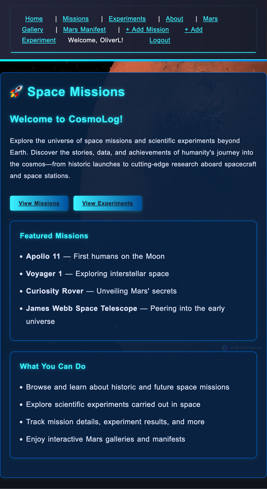

# CosmoLog

## App Description
CosmoLog is a web application for logging, exploring, and sharing space missions and experiments. Users can create, view, and manage missions and experiments, browse Mars rover images, and learn about the latest in space exploration.

## Background
CosmoLog was built to provide a unified platform for space enthusiasts, students, and researchers to chronicle the triumphs and trials of space missions. The app celebrates exploration in all its forms and aims to make space data accessible and engaging.

## Getting Started
- **Deployed App:** [Deployed CosmoLog](https://deployment-url.com)
- **Planning Materials:** [Project Planning Document](https://planning-doc-url.com)

### Local Setup
1. Clone the repository: `git clone https://github.com/OliverPhillips1229/CosmoLog.git`
2. Install dependencies: `pip install -r requirements.txt`
3. Set up PostgreSQL and update `space_missions/settings.py` with your database credentials.
4. Run migrations: `python manage.py migrate`
5. Start the server: `python manage.py runserver`

## Attributions
- NASA Open APIs for images and mission data
- [Transparent Textures](https://www.transparenttextures.com/) for background patterns
- [Google Fonts: Orbitron](https://fonts.google.com/specimen/Orbitron) for sci-fi typography

## Technologies Used
- Python
- Django
- PostgreSQL
- HTML, CSS (Flexbox)
- JavaScript

## Next Steps
- Add user profiles and avatars
- Implement advanced search and filtering for missions/experiments
- Integrate more space agency APIs
- Add social features (comments, likes)
- Improve mobile responsiveness